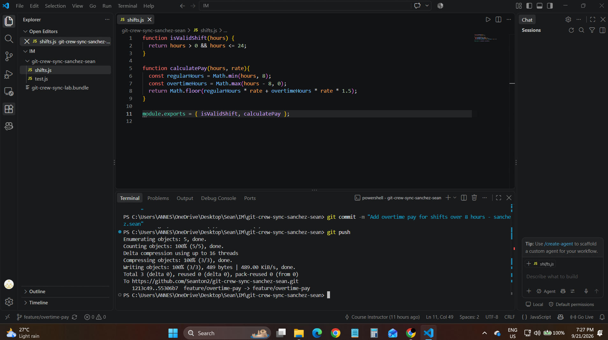
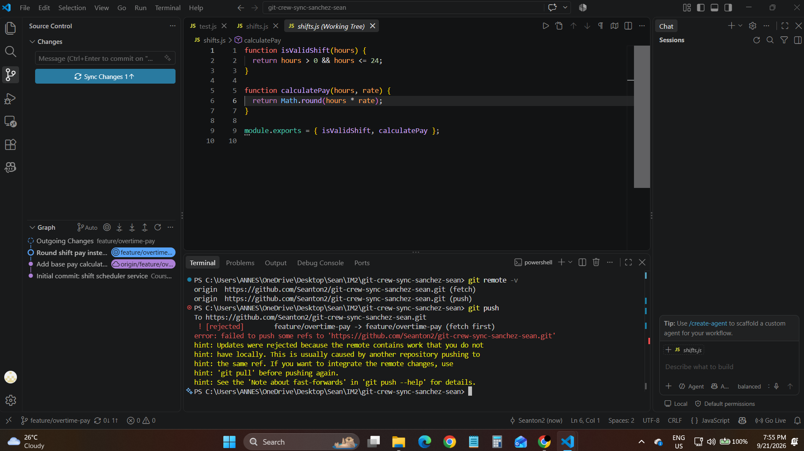
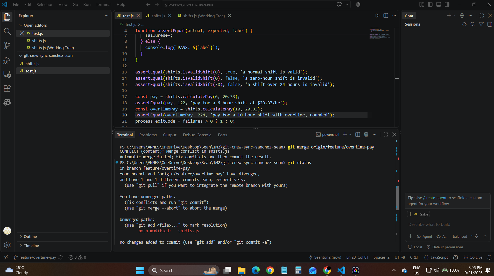
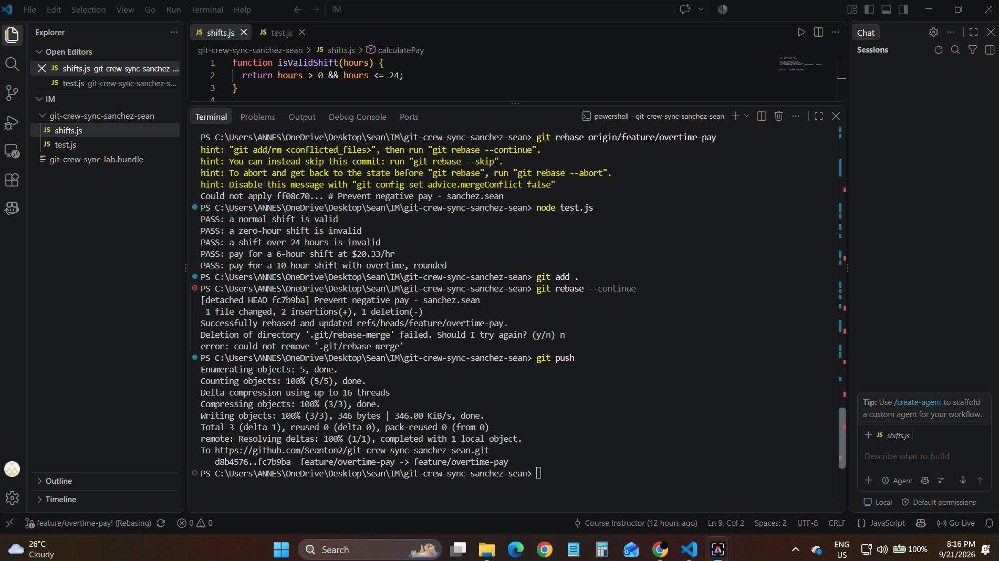
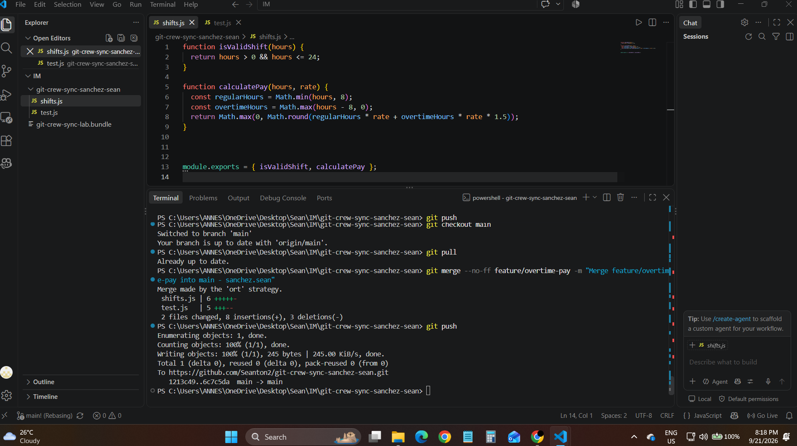
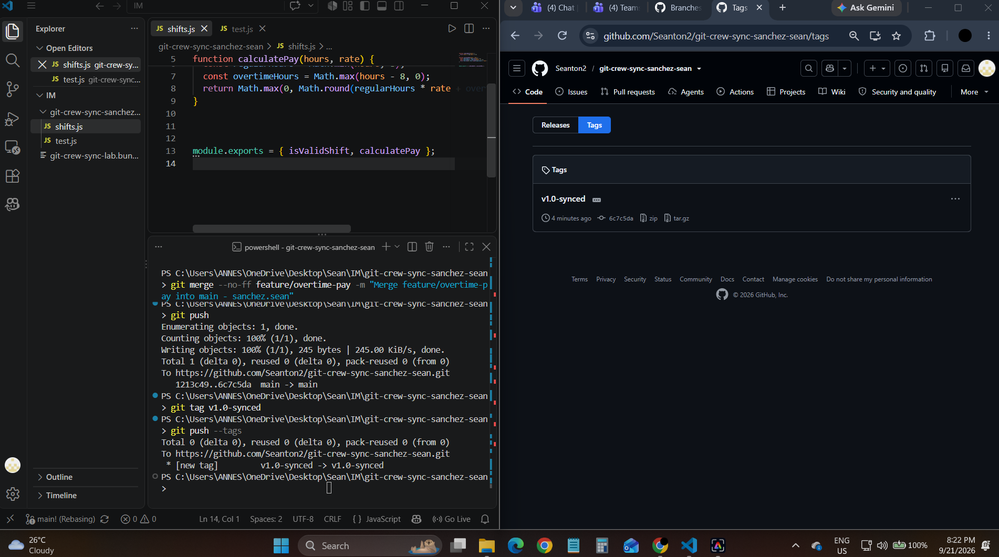

Git Crew Sync Workflow

Name: Sean Anthony P. Sanchez
Repository: https://github.com/Seanton2/git-crew-sync-sanchez-sean

Task 1 evidence

In Clone A.I added overtime pay (time-and-a-half for hours over 8) to calculatePay on feature/overtime-pay and pushed it successfully.

Task 2 evidence

In Clone B.Which had not fetched Clone A's push.I changed the same function to round the pay instead of truncating it. The push was rejected with fetch first.

Task 3 evidence

In Clone B.I ran git fetch and git merge origin/feature/overtime-pay then resolved the conflict in shifts.js so both overtime and rounding are kept and confirmed the tests pass and pushed.

Task 4 evidence

In Clone A.Without fetching.I added a negative-pay guard to calculatePay.The push was rejected again.I then used git fetch and git rebase to resolved the conflict, continued the rebase and pushed without force.

Second rejected push:

Rebase conflict, resolution, and successful push:

Task 5 evidence

In Clone A.I merged the finished feature/overtime-pay branch into main and pushed main.

Task 6 evidence

I tagged the final commit v1.0-synced and pushed the tag. The tag is visible on GitHub.

Questions

Question 1
What did the rejected push error message tell you and why did it happen?

Git rejected my push with a fetch first message. It said GitHub had work that I did not have on my computer.Clone A had already pushed the overtime commit and Clone B had not fetched it yet.Git blocked my push so it would not erase Clone A's work.The same thing happened in Task 4 but with Clone A behind.

Question 2
What is the difference between how you resolved Task 3 with a merge and Task 4 with a rebase?

In Task 3 I fetched and merged in Clone B. Both changes touched the same line so there was a conflict. I fixed it once and kept the overtime and the rounding.Git then made a new merge commit and the history shows two paths joining together.

In Task 4 I fetched and rebased in Clone A.Git put my commit on top of the latest remote work.I fixed a conflict on the same line and kept the negative pay and the rounding.There was no merge commit and the history stayed in a straight line.

So a merge joins two histories while a rebase moves my work on top of the other work.

Question 3
What one habit would have avoided both rejected pushes in this lab?

Running git fetch before I start work and again right before I push. It shows me if the remote has new work.I would have brought that work in first and avoided both rejected pushes.

Question 4
Which approach would you default to on a shared team branch and why?

I would use merge on a shared branch.It does not change any commits that my teammates already have so it is safe.The history gets a little busier but nobody loses work.

Rebase gives a cleaner history but it rewrites commits.That is fine for my own commits that are not pushed yet.On shared work it could force me to push with force and that can overwrite my teammates. So I would rebase my own work and merge shared work.